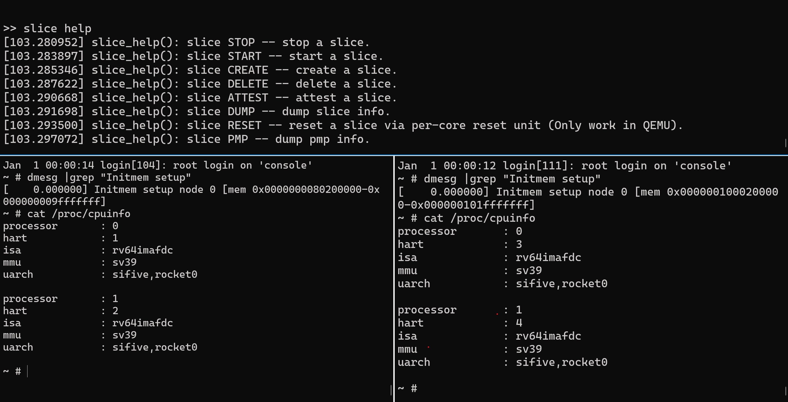

## Quick start with our prebuilt artifact

### Download prebuilts into a docker image

```
cd demo
docker build ./ --tag slice-demo
```

### Step 1: Boot slice-0

```
docker run -it --privileged --cidfile cidfile.txt -v /dev:/dev slice-demo
```

The container will run QEMU to emulate a Microchip PolarFire machine with a
per-core reset device. By default, it uses an example Slice configuration (2
Slices, each using 2 cores and 512 MB memory) provided in
`slice-hss/bypass-uboot/config/slice/config.yaml`. The qemu default console is
used for Slice-0. Type `slice help` to see how to view and change the Slice
configuration.

* QEMU takes several seconds to emulate the process of loading the image from disk to shared memory.
* Booting is complete when the following messages are outputted:
```
[22.641408] boot_opensbi_init_onExit(): boot_service(u54_1)::u54_1:sbi_init 80000000
[22.647483] boot_wait_onEntry(): boot_service(u54_1)::Checking for IPI ACKs: - -
[22.656277] boot_wait_handler(): boot_service(u54_1)::Checking for IPI ACKs: ACK/IDLE ACK
[22.665304] boot_opensbi_init_handler(): boot_service(u54_3)::u54_4:sbi_init 1000000000
[22.671122] boot_opensbi_init_onExit(): boot_service(u54_3)::u54_3:sbi_init 1000000000
[22.676230] boot_wait_onEntry(): boot_service(u54_3)::Checking for IPI ACKs: - -
[22.682224] boot_wait_handler(): boot_service(u54_3)::Checking for IPI ACKs: ACK/IDLE ACK
```

### Step2: Login to Guest Slices



To login into the guest slices, open a new terminal and follow the commands below:
```
docker exec -it $(cat cidfile.txt) telnet localhost 5432
```

Hit enter to enter login information. You will get a prompt:
```
Trying 127.0.0.1...
Connected to localhost.
Escape character is '^]'.

Welcome to Slice
guest-slice login: root
```

Similarly, to login to slice-2, open a new terminal and run:

```
docker exec -it $(cat cidfile.txt) telnet localhost 5433
```

NIT: `docker exec -it $(cat cidfile.txt) telnet localhost 5431` is used to
output messages before a slice is started. It is not necessary for logging into
the guest slices.


## Configure and Manage Slices

Slicevisor in slice-0 can manage slice lifecycles. You can delete, reset, start,
and dump slices using the following commands: 

In slice-0:
```
slice delete ${slice_idx}
slice reset ${slice_idx}
slice start ${slice_idx}
slice dump
slice attest ${slice_idx} ${data(max 64bytes)}
```

### Checking slice configurations from slice-0

In slice-0: Run `slice dump` to check the current slice configurations:
        ```
        slice dump
        slice 1: slice_type        = 1
        slice 1: slice_status      = ACTIVE
        slice 1: Boot HART         = 1
        slice 1: HARTs             = 1*,2*
        slice 1: slice_mem_start   = 0x80000000
        slice 1: slice_mem_size    = 512d MiB
        slice 1: slice_fw_start    = 0x0
        slice 1: slice_fw_size     = 0x0
        slice 1: guest_kernel_src  = 0xa2000740 (loaded by slice-0)
        slice 1: guest_kernel_size = 0x1ce4600
        slice 1: slice_kernel_start= 0x80200000 (copy from guest_kernel_src)
        slice 1: guest_fdt_src     = 0xa3ce4d40 (loaded by slice-0)
        slice 1: slice_fdt_start   = 0x82ee4600 (copy from guest_fdt_src)
        ...

        slice 2: slice_type        = 1
        slice 2: slice_status      = ACTIVE
        slice 2: Boot HART         = 3
        slice 2: HARTs             = 3*,4*
        slice 2: slice_mem_start   = 0x1000000000
        slice 2: slice_mem_size    = 512d MiB
        slice 2: slice_fw_start    = 0x0
        slice 2: slice_fw_size     = 0x0
        slice 2: guest_kernel_src  = 0xa3ce7438 (loaded by slice-0)
        slice 2: guest_kernel_size = 0x1ce7600
        slice 2: slice_kernel_start= 0x1000200000 (copy from guest_kernel_src)
        slice 2: guest_fdt_src     = 0xa59cea38 (loaded by slice-0)
        slice 2: slice_fdt_start   = 0x1002ee7600 (copy from guest_fdt_src)
        ...
        ```

Look for the following details:

* Slice-1 uses harts 1 and 2, while Slice-2 uses harts 3 and 4. Hart-0 is not
  visible in the `dump` command output but is included in Slice-0.
* `guest_kernel_src` and `guest_fdt_src` locates at shared memory;
* `slice_kernel_start` and `slice_fdt_start` locates at guest slice private memory

### Checking slice configurations from guest slice
```
# In slice-1
dmesg |grep "Initmem setup"
[    0.000000] Initmem setup node 0 [mem 0x0000000080200000-0x000000009fffffff]

# cat /proc/cpuinfo
processor       : 0
hart            : 1
isa             : rv64imafdc
mmu             : sv39
uarch           : sifive,rocket0

processor       : 1
hart            : 2
isa             : rv64imafdc
mmu             : sv39
uarch           : sifive,rocket0
```

```
# In slice-2
# dmesg |grep "Initmem setup"
[    0.000000] Initmem setup node 0 [mem 0x0000001000200000-0x000000101fffffff]
# cat /proc/cpuinfo
processor       : 0
hart            : 3
isa             : rv64imafdc
mmu             : sv39
uarch           : sifive,rocket0

processor       : 1
hart            : 4
isa             : rv64imafdc
mmu             : sv39
uarch           : sifive,rocket0
```


### Deleting a slice (e.g., slice-1)
To delete a slice (e.g., slice-1), follow these steps:

1. In slice-0, delete the slice configuration using `slice delete 1` command.
2. Use the trusted slice reset (emulated by QEMU) by running `slice reset 1` command. 
```
slice delete 1
slice reset 1
```

### Creating a new slice
In slice-0, create a new slice-1:
slice create -c <cpu-mask> -m <memory-start> -s <memory-size> -i <guest_kernel_src> -z <guest_kernel_size> -f <guest_fdt_src>
```
slice create -c 0x2 -m 0x1020000000 -s 0x20000000 -i 0xa2000740 -z 0x1ce4600 -f 0xa3ce7d40
```

* Use the same guest_kernel_src and guest_fdt_src from slice-1 or slice-2
  configuration. We only support to load slice kernel from in-ram kernel image
  in our prototype.

* The creation of a new slice is only allowed if its configuration for memory
  and CPU does not overlap with any other slice resources.

* Run `slice dump` again to check the new slice configurations

### Start the new slice

```
slice start 1
```

### Run attestation

```
slice attest 1 test-data
```

Outputs:
```
EC sign Ok! report size: 128, signature size: 96
verification success.
signature:
aa87ca22be8b05378eb1c71ef320ad746e1d3b628ba79b9859f741e082542a385502f25dbf55296c3a545e3872760ab7fa473acc7642e4dee6aba6df54813645b01fbd82ad96e7f48e91b18aed9fd5f19a6f9bef93d663325f8f5997b74ce8f1
report dump
746573742d64617461000000000000000000000000000000000000000000000000000000000000000000000000000000000000000000000000002000000000020000008696f69e60a48778c27b6be3686548600b95092db854daaa3352ac037814df8952217dcc5b633cc9b60c079ebbacd738742f736caa87ca22be8b05378e
        hart_count = 2
        mem_size = 20000000
        digest:
        8696f69e60a48778c27b6be3686548600b95092db854daaa3352ac037814df8952217dcc5b633cc9b60c079ebbacd738
        data:
        617474657374003100746573742d6461746100000000000000000000000000000000000000000000000000000000000000000000000000000000000000000000
```

:key: The attestation and verification keypair is currently hardcoded in slice-hss/bypass-uboot/keys/key_private_key.h and slice-hss/bypass-uboot/keys/key_public_key.h.

### [Optional] Create more slices
To create more slices, follow the same steps as creating a new slice.

Example:

```
slice delete 2
slice reset 2
slice create -c 0x10 -m 0x1000000000 -s 0x20000000 ...
slice create -c 0xc -m 0x80000000 -s 0x20000000 ...
```

```
>> slice dump
slice 1: slice_type        = 1
slice 1: slice_status      = FROZEN
slice 1: Boot HART         = 1
slice 1: HARTs             = 1*
slice 1: slice_mem_start   = 0x1020000000
slice 1: slice_mem_size    = 512d MiB
...

slice 2: slice_type        = 1
slice 2: slice_status      = FROZEN
slice 2: Boot HART         = 2
slice 2: HARTs             = 2*,3*
slice 2: slice_mem_start   = 0x80000000
slice 2: slice_mem_size    = 512d MiB
...

slice 3: slice_type        = 1
slice 3: slice_status      = FROZEN
slice 3: Boot HART         = 4
slice 3: HARTs             = 4*
slice 3: slice_mem_start   = 0x1000000000
slice 3: slice_mem_size    = 512d MiB
...
```

